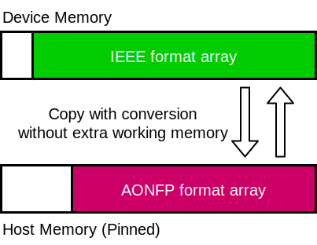
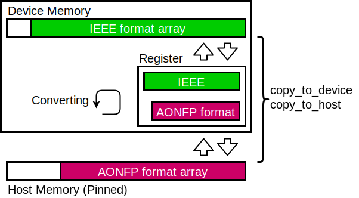

# AONFP (Architecture Oriented Non-standard Floating Point)

## Description
AONFP is a header only C++ library for floating point data compression.
It decomposes a IEEE standard floating point to two bitstrings, one is sign and exponent and the other one is mantissa.

AONFP restricts the type of these bitstrings to `uint8/16/32/64` to reduce complexity.


## Required environment

- C++ 17 or later (`if constexpr` is used in this code)

## Supported data format

### Standard floating point

- `float` (IEEE 754 Binary32)
- `double` (IEEE 754 Binary64)

### Decomposed data type
Data types for `sign_exponent` and `mantissa` are

- `uint64_t`
- `uint32_t`
- `uint16_t`
- `uint8_t`


## Supported operations
- [x] `mul`
- [x] `add`
- [x] `sub`

respectively.

### Sample code
```cpp
const auto v0 = static_cast<double>(1.234);
const auto v1 = static_cast<double>(5.55);
const auto v2 = static_cast<double>(3.333);
uint8_t se0, se1, se2, se3, se4;
uint64_t m0, m1, m2, m3, m4;

// decompose
aonfp::decompose(se0, m0, v0);
aonfp::decompose(se1, m1, v1);
aonfp::decompose(se2, m2, v2);

// compute
aonfp::mul(se3, m3, se0, m0, se1, m1);
aonfp::add(se4, m4, se2, m2, se3, m3);

// compose
const auto v3 = aonfp::compose<double>(se4, m4);
```

## CUDA extension
AONFP has a function which copies an AONFP format array in host memory to device memory while converting to IEEE format.
And also it has a reverse function.



To use this feature, you need to build a static library and link it to your application.


### Supported GPUs

NVIDIA Pascal and later architecture

### Build
```bash
mkdir build
cd build
cmake -DCMAKE_INSTALL_PREFIX=/path/to/install ..
make -j4
make install
```

### Sample code
```cpp
#include <aonfp/cuda_copy.hpp>

aonfp::cuda::copy_to_device(device_array, inc_dst, src_s_exp_array, inc_s_exp, src_mantissa_array, inc_mantissa, N [, block_size = 256, set_cpu_affinity = true, stream = 0]);
aonfp::cuda::copy_to_host(dst_s_exp_array, inc_s_exp, dst_mantissa_array, inc_mantissa, device_array, inc_src, N [, block_size = 256, set_cpu_affinity = true, stream = 0]);
```

### Link
```bash
nvcc ... -L/path/to/install/lib -I/path/to/install/include -laonfp_cuda_copy
```

#### More detail



This functions also set cpu affinity.

## AONFP Q - AONFP for Quantum Computer Simulation

See [AONFP Q](./docs/q.md)
